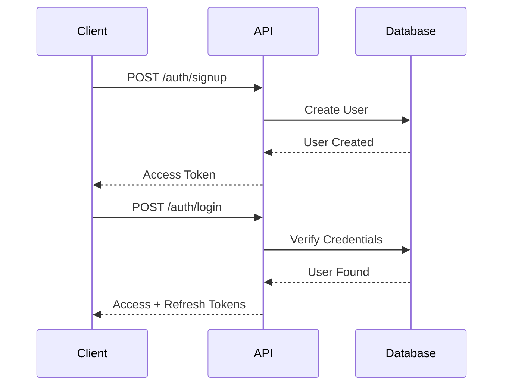
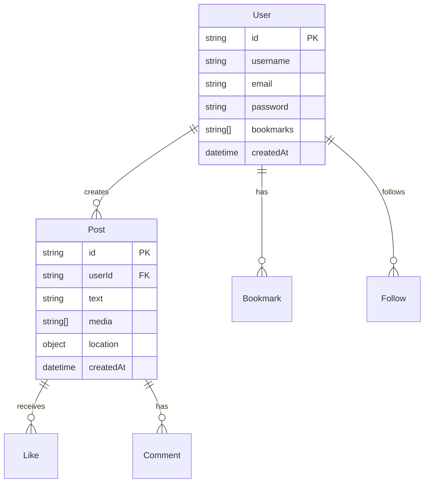

# Mention API Documentation

## Overview

Mention API is a robust backend service built with Express.js and TypeScript, providing functionality for social media interactions including posts, user management, authentication, and real-time communications.

## Tech Stack

- Node.js with TypeScript
- Express.js for REST API
- MongoDB with Mongoose for data storage
- Socket.IO for real-time features
- JWT for authentication

## Getting Started

### Prerequisites

- Node.js (v14 or higher)
- MongoDB instance
- npm or yarn package manager

### Installation

1. Clone the repository
2. Install dependencies:
```bash
npm install
```

3. Create a `.env` file in the root directory with the following variables:
```env
MONGODB_URI=your_mongodb_connection_string
ACCESS_TOKEN_SECRET=your_jwt_access_token_secret
REFRESH_TOKEN_SECRET=your_jwt_refresh_token_secret
PORT=3000
```

### Running the API

Development mode:
```bash
npm run dev
```

Production mode:
```bash
npm run build
npm start
```

### Deployment

#### Docker Deployment
```bash
# Build the Docker image
docker build -t mention-api .

# Run the container
docker run -p 3000:3000 -e MONGODB_URI=your_mongodb_uri mention-api
```

#### Cloud Deployment (Vercel)
1. Configure `vercel.json`:
```json
{
  "version": 2,
  "builds": [{
    "src": "dist/server.js",
    "use": "@vercel/node"
  }],
  "routes": [{
    "src": "/(.*)",
    "dest": "dist/server.js"
  }]
}
```

2. Deploy using Vercel CLI:
```bash
vercel --prod
```

## API Endpoints

### Authentication Flow



### Authentication

#### POST /auth/signup
- Creates a new user account
- Body: `{ username: string, email: string, password: string }`
- Returns:
```json
{
  "user": {
    "id": "user_id",
    "username": "john_doe",
    "email": "john@example.com",
    "createdAt": "2023-01-01T00:00:00Z"
  },
  "accessToken": "eyJhbGciOiJIUzI1NiIs..."
}
```

#### POST /auth/login
- Authenticates existing user
- Body: `{ email: string, password: string }`
- Returns:
```json
{
  "accessToken": "eyJhbGciOiJIUzI1NiIs...",
  "refreshToken": "eyJhbGciOiJIUzI1NiIs..."
}
```

### Posts

#### POST /posts
- Creates a new post
- Authentication: Bearer token required
- Body:
```json
{
  "text": "Hello world!",
  "media": ["image1.jpg"],
  "location": {
    "longitude": -73.935242,
    "latitude": 40.730610
  }
}
```
- Returns:
```json
{
  "id": "post_id",
  "text": "Hello world!",
  "media": ["image1.jpg"],
  "location": {
    "type": "Point",
    "coordinates": [-73.935242, 40.730610]
  },
  "createdAt": "2023-01-01T00:00:00Z",
  "user": {
    "id": "user_id",
    "username": "john_doe"
  }
}
```

#### GET /posts/explore
- Retrieves posts for exploration
- Query params: `limit` (default: 20), `offset` (default: 0)
- Returns:
```json
{
  "posts": [
    {
      "id": "post_id",
      "text": "Post content",
      "user": {
        "id": "user_id",
        "username": "john_doe"
      },
      "createdAt": "2023-01-01T00:00:00Z"
    }
  ],
  "total": 100,
  "hasMore": true
}
```

### Users

#### GET /users/:username
- Retrieves user profile
- Authentication: Bearer token required
- Returns:
```json
{
  "id": "user_id",
  "username": "john_doe",
  "bio": "Hello, I'm John!",
  "followersCount": 1000,
  "followingCount": 500,
  "postsCount": 100,
  "isFollowing": true
}
```

## Database Schema Relationships



## Performance Optimization

### Caching Strategy
- Implement Redis caching for:
  - User profiles (TTL: 1 hour)
  - Popular posts (TTL: 15 minutes)
  - Trending hashtags (TTL: 5 minutes)

### Database Indexing
```javascript
// User Collection Indexes
db.users.createIndex({ "username": 1 }, { unique: true })
db.users.createIndex({ "email": 1 }, { unique: true })

// Post Collection Indexes
db.posts.createIndex({ "userId": 1, "createdAt": -1 })
db.posts.createIndex({ "location": "2dsphere" })
```

## Monitoring and Logging

### Health Check Endpoint
```
GET /health
Response: {
  "status": "healthy",
  "version": "1.0.0",
  "uptime": 1000,
  "mongoStatus": "connected"
}
```

### Logging
- Use Winston for structured logging
- Log levels: error, warn, info, debug
- Include request ID in all logs

## Troubleshooting Guide

### Common Issues

1. Connection Timeouts
```
Error: MongoTimeoutError
Solution: Check MongoDB connection string and network connectivity
```

2. Authentication Failures
```
Error: JsonWebTokenError
Solution: Verify token expiration and secret keys
```

3. Rate Limit Exceeded
```
Error: 429 Too Many Requests
Solution: Implement exponential backoff in client
```

## Contributing

1. Fork the repository
2. Create your feature branch
3. Commit your changes
4. Push to the branch
5. Create a new Pull Request

## License

AGPL License
