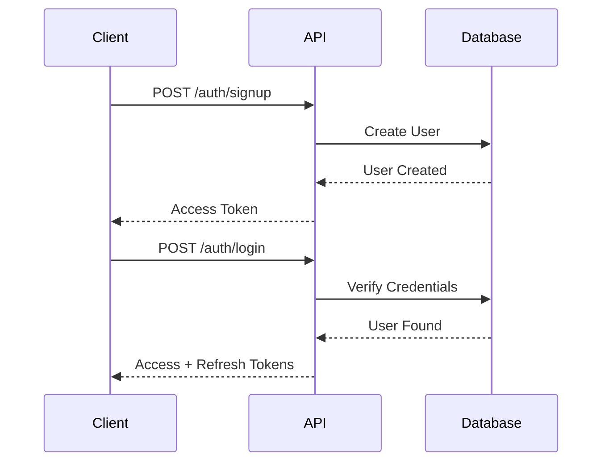
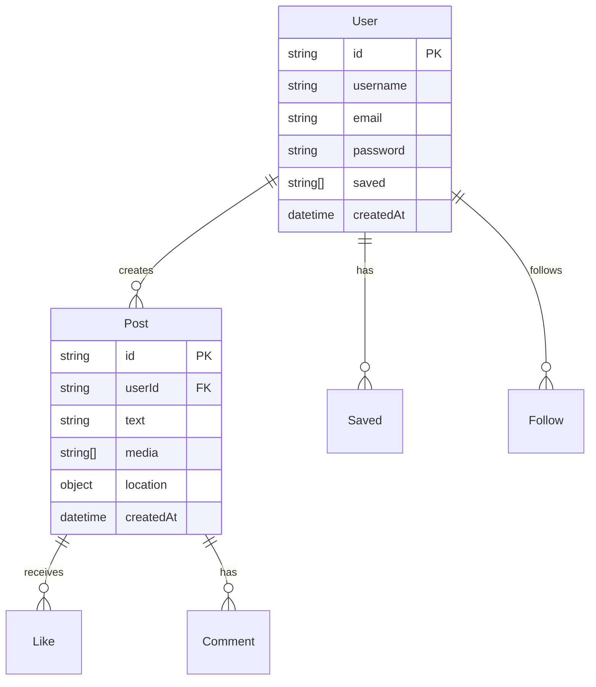

# @mention/backend

> The backend package of the Mention monorepo - A robust API service built with Express.js and TypeScript.

---

## Overview

This is the **backend package** of the **Mention** monorepo. The Mention API is a robust backend service built with Express.js and TypeScript, providing functionality for social media interactions including posts, user management, authentication, and real-time communications.

## Tech Stack

- Node.js with TypeScript
- Express.js for REST API
- MongoDB with Mongoose for data storage
- Socket.IO for real-time features
- JWT for authentication

## Getting Started

### Prerequisites

- Node.js 18+ and npm 8+
- MongoDB instance
- Git

### Development Setup

#### Option 1: From the Monorepo Root (Recommended)
```bash
# Clone the repository
git clone https://github.com/OxyHQ/Mention.git
cd Mention

# Install all dependencies
npm run install:all

# Start backend development
npm run dev:backend
```

#### Option 2: From This Package Directory
```bash
# Navigate to this package
cd packages/backend

# Install dependencies
npm install

# Start development server
npm run dev
```

### Environment Configuration

Create a `.env` file in this package directory with the following variables:

```env
# Database
MONGODB_URI=your_mongodb_connection_string

# Authentication
# WE USE OXY FOR AUTHENTICATION

# Server Configuration
PORT=3000
NODE_ENV=development

# External Services
OPENAI_API_KEY=your_openai_api_key
TELEGRAM_BOT_TOKEN=your_telegram_bot_token
```

### Running the API

#### Development Mode
```bash
npm run dev
```

#### Production Mode
```bash
npm run build
npm start
```

### Database Setup

The API uses MongoDB with Mongoose. Make sure your MongoDB instance is running and accessible.

#### Running Migrations
```bash
# Development environment
npm run migrate:dev

# Production environment
npm run migrate
```

## API Endpoints

### Authentication Flow



### Authentication

#### POST /auth/signup
- Creates a new user account
- Body: `{ username: string, email: string, password: string }`
- Returns:
```json
{
  "user": {
    "id": "user_id",
    "username": "john_doe",
    "email": "john@example.com",
    "createdAt": "2023-01-01T00:00:00Z"
  },
  "accessToken": "eyJhbGciOiJIUzI1NiIs..."
}
```

#### POST /auth/login
- Authenticates existing user
- Body: `{ email: string, password: string }`
- Returns:
```json
{
  "accessToken": "eyJhbGciOiJIUzI1NiIs...",
  "refreshToken": "eyJhbGciOiJIUzI1NiIs..."
}
```

### Posts

#### POST /posts
- Creates a new post
- Authentication: Bearer token required
- Body:
```json
{
  "text": "Hello world!",
  "media": ["image1.jpg"],
  "location": {
    "longitude": -73.935242,
    "latitude": 40.730610
  }
}
```
- Returns:
```json
{
  "id": "post_id",
  "text": "Hello world!",
  "media": ["image1.jpg"],
  "location": {
    "type": "Point",
    "coordinates": [-73.935242, 40.730610]
  },
  "createdAt": "2023-01-01T00:00:00Z",
  "user": {
    "id": "user_id",
    "username": "john_doe"
  }
}
```

#### GET /posts/explore
- Retrieves posts for exploration
- Query params: `limit` (default: 20), `offset` (default: 0)
- Returns:
```json
{
  "posts": [
    {
      "id": "post_id",
      "text": "Post content",
      "user": {
        "id": "user_id",
        "username": "john_doe"
      },
      "createdAt": "2023-01-01T00:00:00Z"
    }
  ],
  "total": 100,
  "hasMore": true
}
```

### Users

#### GET /users/:username
- Retrieves user profile
- Authentication: Bearer token required
- Returns:
```json
{
  "id": "user_id",
  "username": "john_doe",
  "bio": "Hello, I'm John!",
  "followersCount": 1000,
  "followingCount": 500,
  "postsCount": 100,
  "isFollowing": true
}
```

## Database Schema Relationships



## Development Scripts

- `npm run dev` — Start development server with hot reload
- `npm run build` — Build the project
- `npm run start` — Start production server
- `npm run lint` — Lint codebase
- `npm run clean` — Clean build artifacts
- `npm run migrate` — Run database migrations
- `npm run migrate:dev` — Run database migrations in development
- `npm run test` — Run tests (placeholder)

## Monorepo Integration

This package is part of the Mention monorepo and integrates with:

- **@mention/frontend**: React Native application
- **@mention/shared-types**: Shared TypeScript type definitions

### Shared Dependencies
- Uses `@mention/shared-types` for type safety across packages
- Integrates with `@oxyhq/services` for common functionality

## Performance Optimization

### Caching Strategy
- Implement Redis caching for:
  - User profiles (TTL: 1 hour)
  - Popular posts (TTL: 15 minutes)
  - Trending hashtags (TTL: 5 minutes)

### Database Indexing
```javascript
// User Collection Indexes
db.users.createIndex({ "username": 1 }, { unique: true })
db.users.createIndex({ "email": 1 }, { unique: true })

// Post Collection Indexes
db.posts.createIndex({ "userId": 1, "createdAt": -1 })
db.posts.createIndex({ "location": "2dsphere" })
```

## Monitoring and Logging

### Health Check Endpoint
```
GET /health
Response: {
  "status": "healthy",
  "version": "1.0.0",
  "uptime": 1000,
  "mongoStatus": "connected"
}
```

### Logging
- Use Winston for structured logging
- Log levels: error, warn, info, debug
- Include request ID in all logs

## Deployment

### Docker Deployment
```bash
# Build the Docker image
docker build -t mention-api .

# Run the container
docker run -p 3000:3000 -e MONGODB_URI=your_mongodb_uri mention-api
```

### Cloud Deployment (Vercel)
1. Configure `vercel.json`:
```json
{
  "version": 2,
  "builds": [{
    "src": "dist/server.js",
    "use": "@vercel/node"
  }],
  "routes": [{
    "src": "/(.*)",
    "dest": "dist/server.js"
  }]
}
```

2. Deploy using Vercel CLI:
```bash
vercel --prod
```

## Federation (ActivityPub / Fediverse)

Mention supports ActivityPub federation, allowing users to interact with Mastodon, Threads, and other fediverse platforms.

### Architecture

Each Mention user gets a fediverse identity at `@username@mention.earth`. Data is split across two systems:

- **Users** live in Oxy (federated users have `type: 'federated'`)
- **Posts** live in Mention's MongoDB

Both are linked by `oxyUserId`. When a remote actor is resolved, a shadow Oxy user is created and its ID is stored on the `FederatedActor` record and on any posts from that actor.

### Endpoints

**Protocol endpoints** (public, no auth -- served to other AP servers):

| Method | Path | Description |
|---|---|---|
| GET | `/.well-known/webfinger?resource=acct:user@mention.earth` | Profile discovery |
| GET | `/ap/users/:username` | Actor profile (AP Person object) |
| POST | `/ap/users/:username/inbox` | Receive activities from remote instances |
| POST | `/ap/inbox` | Shared inbox |
| GET | `/ap/users/:username/outbox` | Public posts as AP activities |

**API endpoints** (auth required -- used by the Mention frontend):

| Method | Path | Description |
|---|---|---|
| POST | `/federation/follow` | Follow a remote actor |
| POST | `/federation/unfollow` | Unfollow a remote actor |
| GET | `/federation/following` | List federated accounts you follow |
| GET | `/federation/followers` | List remote followers |
| GET | `/federation/actor/posts?uri=...` | Get locally stored posts from a federated actor |
| GET | `/federation/search?q=user@instance` | Search fediverse handles |
| GET | `/federation/lookup?handle=@user@instance` | Resolve a single handle |

### How Sync Works

1. **Follow triggers backfill**: When a follow is accepted, `syncOutboxPosts` fetches the last 20 posts from the remote actor's outbox and stores them locally.
2. **Incoming posts**: The shared inbox only accepts `Create` activities from actors that have at least one local follower.
3. **HTTP signatures**: All outbound requests (fetches and deliveries) use HTTP Signatures. RSA keypairs are generated per-user and stored in the `ActorKeyPair` collection.

### Instance-Specific Notes

| Instance | Notes |
|---|---|
| **Mastodon** (mastodon.social) | Standard AP. Works with unsigned fetches for public data. Test: `@gargron@mastodon.social` |
| **Threads** (threads.net) | Requires signed fetches. Uses numeric user IDs resolved via WebFinger. Test: `@zuck@threads.net` |

### Local Development

Federation requires a publicly reachable domain. For local testing:

```bash
# 1. Start the backend
bun run dev:backend

# 2. In another terminal, create a tunnel
cloudflared tunnel --url http://localhost:3000

# 3. Set the tunnel domain in .env
FEDERATION_DOMAIN=your-random-subdomain.trycloudflare.com
```

Restart the backend after changing `FEDERATION_DOMAIN`. The tunnel URL changes each run unless you use a named tunnel.

### Environment Variables

```env
FEDERATION_DOMAIN=mention.earth          # Domain for actor URLs (default: mention.earth)
FEDERATION_ENABLED=true                  # Set to "false" to disable (default: true)
FEDERATION_BLOCKED_DOMAINS=bad.example   # Comma-separated blocked domains
FEDERATION_DELIVERY_RETRIES=5            # Max retry attempts for outgoing activities
FEDERATION_MAX_CONTENT_LENGTH=50000      # Max content size for incoming activities
```

### Deployment Requirements

The `/.well-known/` and `/ap/` paths on the federation domain (`mention.earth`) **must** route to this backend service, not the static frontend. In production, Cloudflare redirect rules handle this (see [DigitalOcean Deployment](../../docs/DIGITALOCEAN_DEPLOYMENT.md)).

### Key Files

- `src/routes/webfinger.routes.ts` — WebFinger endpoint
- `src/routes/federation.routes.ts` — ActivityPub protocol endpoints
- `src/routes/federation.api.routes.ts` — Frontend-facing API endpoints
- `src/services/FederationService.ts` — Core federation logic (actor resolution, inbox handling, outbox sync)
- `src/services/FederationJobScheduler.ts` — Background jobs (actor refresh, delivery retry)
- `src/utils/federation/constants.ts` — Configuration and URL builders
- `src/utils/federation/crypto.ts` — HTTP signature signing/verification
- `src/models/FederatedActor.ts` — Cached remote actor profiles (includes `oxyUserId` link)
- `src/models/FederatedFollow.ts` — Follow relationships
- `src/models/ActorKeyPair.ts` — RSA keypairs for local users
- `src/models/FederationDeliveryQueue.ts` — Outgoing activity retry queue

## Push Notifications (FCM)

Set these env vars in `packages/backend/.env`:

```
FIREBASE_PROJECT_ID=your-project-id
FIREBASE_SERVICE_ACCOUNT_BASE64=base64-encoded-service-account-json
```

Routes:
- POST /api/notifications/push-token { token, type, platform, deviceId?, locale? }
- DELETE /api/notifications/push-token { token }

When a notification is created, the server attempts to send an FCM push to registered tokens.

## Troubleshooting Guide

### Common Issues

1. Connection Timeouts
```
Error: MongoTimeoutError
Solution: Check MongoDB connection string and network connectivity
```

2. Authentication Failures
```
Error: JsonWebTokenError
Solution: Verify token expiration and secret keys
```

3. Rate Limit Exceeded
```
Error: 429 Too Many Requests
Solution: Implement exponential backoff in client
```

## Contributing

Contributions are welcome! Please see the [main README](../../README.md) for the complete contributing guidelines.

1. Fork the repository
2. Create a feature branch
3. Make your changes
4. Run tests and linting: `npm run test && npm run lint`
5. Submit a pull request

## License

This project is licensed under the AGPL License.
